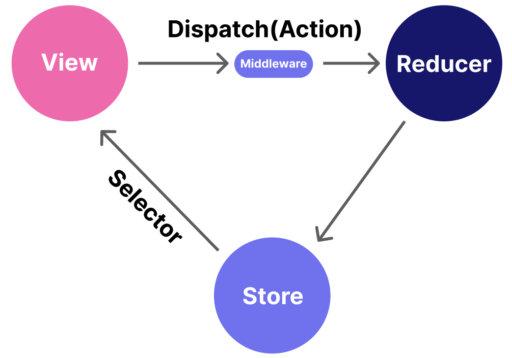

# Express

#### Express 란

* Node.js 웹 애플리케이션 프레임워크
* Node.js를 사용하여 쉽게 서버를 구성할 수 있게 만든 클래스와 라이브러리의 집합체
* 타입스크립트로 작성한 것을 node로 바로 컴파일하기 위해 ts-node로 실행할 것.
* 코드를 수정할 때마다 서버를 재실행하는 문제를 피하기 위해 nodemon 사용할 것.

#### URL 구조

<figure><figcaption></figcaption></figure>

* Scheme(=Protocol) : 브라우저가 리소스를 요청하기 위해 사용해야 하는 프로토콜\
  \- HTTP\
  \- HTTPS
* Domain Name\
  \- 최상위 도메인 (ex. com)\
  \- 호스트명(차상위  도메인) (ex. www)\
  \- 도메인 이름 (ex. google)
* Port : 포트를 통해 어떤 서버를 이용할지 결정하며, :(콜론) 뒤에 나온다.
* Path : 파일의 경로를 가리키며, /(슬래시) 뒤에 나온다.
* Parameter : 파라미터는 쿼리 스트링이라고도 불린다.\
  \- key=value 형태\
  \- ?뒤에 나열, &기호로 구분되어 여러개 존재 가능
* Anchor(=Fragment) : 프래그먼트(Fragment), 해시태그(Hashtag)라고도 부르며, 특정 요소를 지시할 수 있다.\
  \- ex. 해시태그로 이동을 원하는 요소의 id를 링크로 연결하면 스크롤 이동없이 바로 해당 위치로 이동한다. 파일 디렉토리 및 파일 이름과 유사한 역할로 쓰이는 경우도 있다.

####

#### REST API

대개는 “필딩 제약 조건” 4가지를 모두 만족하지 않고, Resource와 HTTP Verb만 도입하는 수준으로 사용.

* 이렇게 안 하고: /write-post
* 이렇게 하자: /posts → 뭔가를 한다 (CRUD)

CRUD에 대해 HTTP Method를 대입. Read는 Collection(복수)과 Item(Element)(단수)로 나뉨.

#### HTTP Method(CRUD)

기본 리소스 URL: /products

1. Read (Collection) → GET /products ⇒ 상품 목록 확인
2. Read (Item) → GET /products/{id} ⇒ 특정 상품 정보 확인
3. Create (Collection Pattern 활용) → POST /products ⇒ 상품 추가 (JSON 정보 함께 전달)
4. Update (Item) → PUT 또는 PATCH /products/{id} ⇒ 특정 상품 정보 변경 (JSON 정보 함께 전달)
5. Delete (Item) → DELETE /products/{id} ⇒ 특정 상품 삭제
